# Hi, I'm Savan Patel 👋

<picture>
  <source media="(prefers-color-scheme: dark)" srcset="./dark.svg">
  <source media="(prefers-color-scheme: light)" srcset="./light.svg">
  
</picture>

  <b>AI/ML Engineer · Computer Vision · Deep Learning · Multimodal AI</b>

  👁️ Computer Vision &nbsp;·&nbsp; 🎯 YOLO / Object Detection &nbsp;·&nbsp; 🐍 Python &nbsp;·&nbsp; 🔥 PyTorch
  &nbsp;·&nbsp; 🐳 Docker &nbsp;·&nbsp; 📊 Data Analytics

I build **computer vision models, multimodal AI systems, and data-driven ML applications**, from dataset preparation and training to evaluation and deployment-ready models.

M.Tech Data Science student at PDEU, currently working as an **AI/ML Intern** on YOLO-based object detection. My interests sit at the intersection of **computer vision, deep learning, multimodal AI, NLP and applied machine learning**.

---

## 🤖 What I Build

- 👁️ **Computer vision systems** — YOLO-based object detection, dataset annotation, training and evaluation
- 🚀 **Model optimization & deployment** — hyperparameter tuning, performance analysis and conversion to deployment-ready formats
- 🧠 **Multimodal AI** — systems that combine video, audio, text and images (deepfake detection, clinical assistant)
- 📝 **NLP with transformers** — LegalBERT, Hugging Face pipelines and interpretable classification
- 📈 **Predictive ML applications** — XGBoost models, digital twins and time-series prediction
- 📊 **Data analytics** — EDA, dashboards and reports that support decisions
- 🐳 **Tooling** — Python, Docker, Git, Streamlit and Kafka-based data pipelines

---

## 💼 Experience

### AI/ML Intern — Atomo Innovations Pvt. Ltd.

**Jun 2026 – Present** · On-site

- Developing, training and fine-tuning **YOLO-based computer vision models** for object detection tasks
- Handling **dataset preparation, annotation and model evaluation**
- Optimizing and testing models through **hyperparameter tuning, performance analysis and conversion to deployment-ready formats**

### Data Analytics Intern — Unified Mentor Pvt. Ltd.

**Jul 2025 – Oct 2025** · Hybrid

- Performed data preprocessing, exploratory data analysis and visualization
- Built analytical dashboards and reports to support data-driven decision making

### Data Analytics Intern — Maxgen Technologies Pvt. Ltd.

**Jan 2025 – Jun 2025** · On-site

- Worked on real-world datasets: data cleaning, exploratory analysis and predictive modeling
- Used Python-based tools to find patterns and business insights in structured data

---

## 🧩 Featured Projects

### 🔥 Multimodal Deepfake Detection

[GitHub Repository](https://github.com/SavanPatel02/Multimodal-Deepfake-Detection)

Detects synthetic media by analyzing **facial video frames and speech audio together**.

- Mel Spectrogram feature extraction for audio, facial feature encoding for video
- Architectures that learn correlations between visual and audio modalities
- **Python · PyTorch · Computer Vision · Audio Processing**

### 🩺 Multimodal AI Clinical Assistant

[GitHub Repository](https://github.com/SavanPatel02/Multimodal-AI-Clinical-Assistant)

Analyzes **text, speech and medical images** to support healthcare insights.

- NLP and speech recognition to interpret patient symptoms from voice and text
- Computer vision for medical image understanding and preliminary diagnosis
- **Python · Deep Learning · NLP · Transformers · Speech Processing**

### 🏗️ Digital Twin for Smart Infrastructure

[GitHub Repository](https://github.com/SavanPatel02/Digital-Twin-Based-Prediction-for-Smart-Infrastructure)

Virtual model of bridges and pipelines that predicts failures and maintenance needs.

- Simulated sensor data, feature engineering and ML-based failure prediction
- **Python · Machine Learning · Time Series · Data Analytics**

### ⚖️ Legal Document Classification

[GitHub Repository](https://github.com/Het-Buch/Legal-Document-Classifier)

Transformer-based classifier for long legal contracts.

- LegalBERT with domain-adaptive pre-training and token-based chunking for long documents
- TF-IDF + One-vs-Rest SVM baseline and an interpretable inference pipeline that highlights influential clauses
- **Python · PyTorch · Hugging Face · LegalBERT · Scikit-learn**

### 🩻 Disease Prediction System

[GitHub Repository](https://github.com/SavanPatel02/Disease-Prediction)

- Symptom-based disease prediction with an optimized XGBoost model
- Interactive Streamlit app that returns predictions in real time
- **Python · XGBoost · Streamlit**

---

## 🛠️ Engineering Stack

### 🤖 AI / Machine Learning

`Machine Learning` `Deep Learning` `Computer Vision` `Object Detection` `YOLO` `Ultralytics` `Predictive Modeling` `Model Evaluation`

### 🧠 Frameworks & Libraries

`PyTorch` `TensorFlow` `Keras` `Hugging Face Transformers` `Scikit-learn` `XGBoost` `OpenCV` `Pandas` `NumPy`

### 💻 Languages

`Python` `SQL` `Java` `C`

### 🗄️ Data & Databases

`SQL` `MongoDB` `Apache Kafka` `Power BI` `Excel`

### ☁️ Tools & Cloud

`Git` `Docker` `Streamlit` `AWS (Data Engineering)` `Google Cloud`

---

## 🎓 Education

- **M.Tech in Data Science** — Pandit Deendayal Energy University (PDEU), Gandhinagar · 2025 – Present
- **B.Tech in Computer Engineering** — Silver Oak University, Ahmedabad · 2021 – 2025

## 📜 Certifications

- AWS — Data Engineering on AWS: A Streaming Data Pipeline Solution
- AWS — A Day in the Life of a Data Engineer
- Accenture — Data Analytics & Visualization Job Simulation
- Deloitte — Data Analytics Job Simulation
- Google Cloud — Google Cloud Fundamentals and Generative AI Study Jams

---

<h2 align="center">Contribution Activity</h2>

  <picture>
    <source media="(prefers-color-scheme: dark)" srcset="https://raw.githubusercontent.com/SavanPatel02/github-snake/output/github-snake-dark.svg">
    <source media="(prefers-color-scheme: light)" srcset="https://raw.githubusercontent.com/SavanPatel02/github-snake/output/github-snake.svg">
    
  </picture>

---

## 📫 Connect With Me

💼 [LinkedIn](https://www.linkedin.com/in/savanpatel02)  
🐙 [GitHub](https://github.com/SavanPatel02)  
📧 [Email](mailto:savanpatel0208@gmail.com)

> **Turning data into decisions.**
